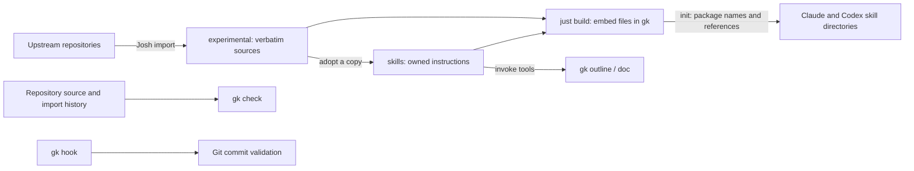

# Architecture

Gist transfers ways to steer agent work. Owned skills are the product; `gk`
provides deterministic operations and distributes the skill files. The manifesto
sets the principles, contributor instructions define the workflow, and cases
define observable behavior. ADRs explain decisions rather than replace this map.

## Parts and boundaries

| Part | Responsibility | Source of behavior |
|---|---|---|
| `skills/` | Agent decisions and reference material, portable between hosts | [Skill contract](skill-contract.md), [cases](cases/README.md) |
| `gist-cli/src/init.rs` | Embed and collect files, namespace vendor references, protect local edits, track uninstall | ADRs [0002](adr/0002-embed-skills-for-init.md), [0005](adr/0005-prefix-experimental-skills-at-install.md), [0007](adr/0007-manifest-driven-uninstall.md), [0008](adr/0008-untrusted-manifests-and-symlinks.md), [0010](adr/0010-refuse-a-symlinked-root-and-check-every-root-first.md) |
| `gist-cli/src/doc/` | Classify added comment lines with their full-file context; report a triage metric | [0001](adr/0001-diff-with-libgit2.md), `gist-doc-review` |
| `gist-cli/src/outline.rs` | Count files and bytes by extension, respecting ignore rules by default | [Outline cases](cases/gist-outline.md) |
| `gist-cli/src/check.rs` | Validate repository structure and vendor content, without installing anything | [Check cases](cases/repository-checks.md), [0012](adr/0012-validate-repository-content.md) |
| `gist-cli/src/hook.rs` | Validate commit messages and explicitly install Git hook shims | [0009](adr/0009-install-git-hooks-with-gk.md) |
| `gist-core` | Human rendering, JSON envelope, exit codes | [Tool contract](tool-contract.md) |
| `scripts/vendor.sh`, `views/` | Import upstream history; optionally project selected paths with Josh | [0004](adr/0004-compose-via-josh.md) |

The CLI owns filesystem and Git interactions. Skills interpret tool results and
support human decisions. A green command or a successful file installation is
not evidence that the resulting skill makes the intended decisions.

## Data and lifecycle

The build embeds owned and experimental source files; `build.rs` invalidates the
build when those trees change. Running tools needs no source checkout. `gk check`
is different: it checks a supplied Gist source tree and needs its import history.

`init` computes the selected content before writing to the requested roots.
Vendor names and supported skill references are transformed in memory; upstream
files stay verbatim. Both hosts receive the same computed bytes, including any
host-specific metadata. Install conflicts preserve local content. A per-root
manifest stores installed paths and hashes; uninstall consults that record.
Renamed or removed skills currently require explicit uninstall/reinstall; this
is not an automatic upgrade reconciler. See
[ADR 0007](adr/0007-manifest-driven-uninstall.md) for manifest-driven uninstall.

`rules/` contains reusable guidance. Merely storing it there does not activate
it: this repo's agent entry points explicitly route to applicable rules.
Consumer setup must do the same; `init` currently installs skills only.

## Review attention

Probe `init.rs` and `hook.rs` when writes, deletions, symlink handling, or persisted
formats change. Probe packaging when names, dependencies, or resource paths
change. Probe `check.rs` when deciding what a green result means. These are manual
review reminders; no risk-routing hook exists yet.

CI validates on Linux. macOS behavior remains unverified. Automated coherence
mapping, historical test-to-case backfill, and executable skill-resource modes
are tracked in `TODO.md`; they are not claims made by the current checks.
