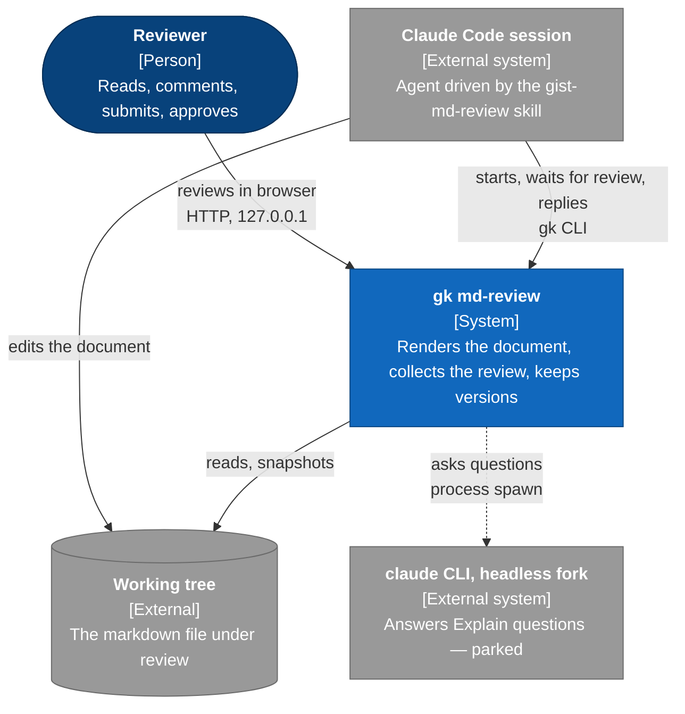
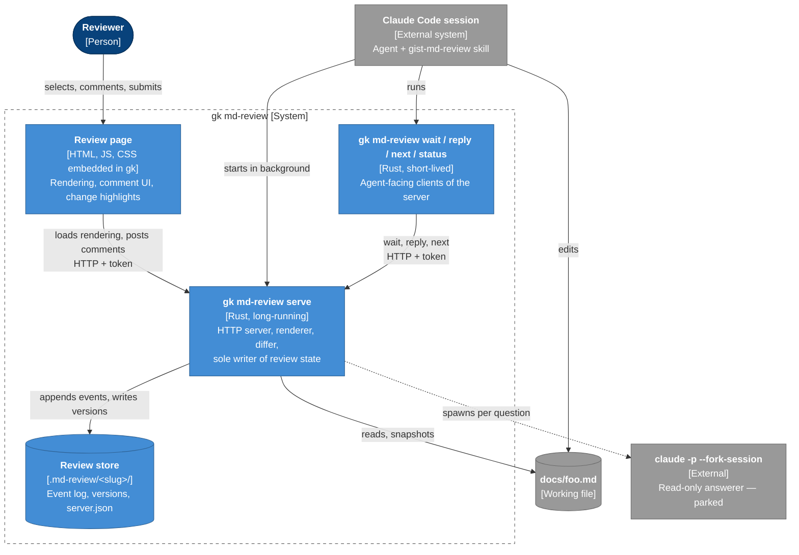
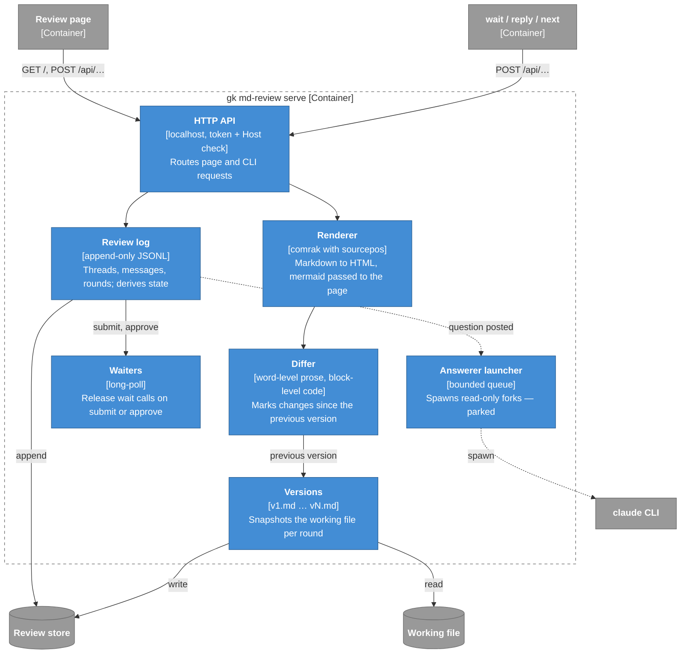
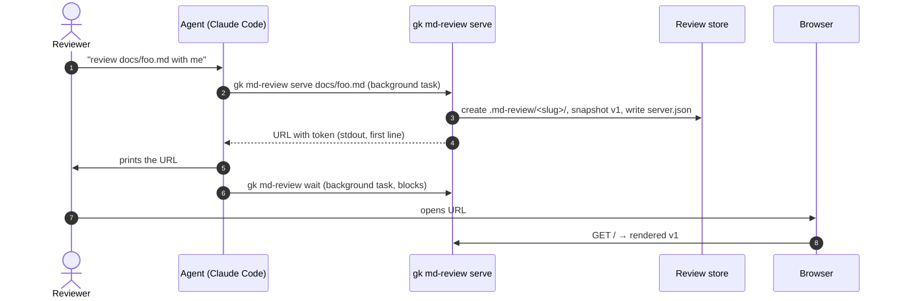
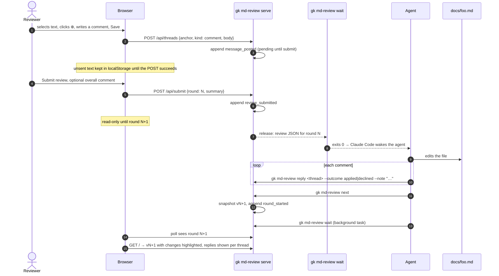
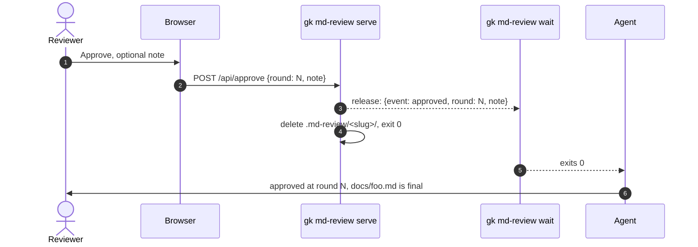
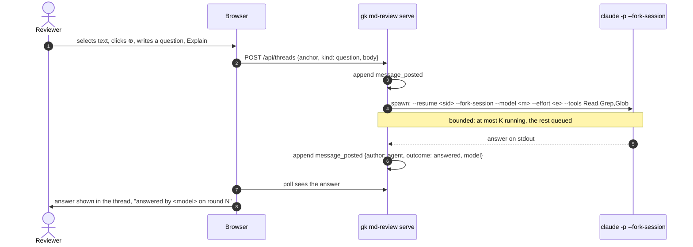

# Markdown review loop — high-level design (HLD)

Detail lives in DLDs next to this file: the review page in
[md-review-dld-page.md](md-review-dld-page.md).

Status: draft, under review. Not built. Decisions that survive review move to
ADRs; observable behavior moves to `docs/cases/md-review.md`.

## Problem

Reviewing a long markdown document with an agent in a terminal is slow. The
human has to quote the text they mean, the agent has to find it, and after an
edit nobody sees what changed. The human wants to read the rendered document,
mermaid included, comment on any selection, submit the whole review at once,
and see the next version with its changes highlighted.

## Scope

v1:

- One markdown file per review, rendered in a local browser page.
- Comments on arbitrary selections; the agent receives them only on submit.
- Rounds: every submit produces a new version; the page highlights what
  changed since the previous one.
- A toolbar with Submit review (optional overall comment) and Approve,
  which needs no comments. Approve ends the review and drops the
  intermediate versions.
- Host: Claude Code only.

Parked, designed for but not built:

- **Explain.** A question on a selection, answered while the review goes on,
  without editing the file. Answered by a read-only fork of the agent session.
- **Codex** as a second host.
- **Live comments** delivered one by one instead of per submit.

Out of scope: reviewing code, multi-user review, anything reachable from
outside the machine.

## Principles

1. **The file on disk is the document.** The agent edits it with its normal
   tools. `gk` never rewrites the markdown; it only snapshots it.
2. **One writer.** Only the server process writes review state. Every other
   `gk md-review` command is a client of it.
3. **The agent is woken, not polled.** Claude Code wakes the agent when a
   background task exits. `gk md-review wait` exits on submit; no MCP, no
   "I'm done" typed in chat.
4. **Nothing is lost on a crash.** State is an append-only log on disk, not
   server memory. A restarted server resumes the review.
5. **The skill owns the procedure.** `gk` output is data plus a one-line
   command reminder, never a prompt. Changing the workflow is a skill edit,
   not a Rust change.
6. **Explain never edits.** The answerer runs with read-only tools; that is
   enforced by the tool allowlist, not asked for in a prompt.

## Context (C4 level 1)

C4 notation drawn as mermaid flowcharts; mermaid's own C4 layout overlaps
labels. Dark blue is a person, blue is this system, grey is outside it,
dotted lines are parked.



## Containers (C4 level 2)



| Container | Lifetime | Writes |
|---|---|---|
| Review page | a browser tab | nothing; posts to the server |
| `serve` | from start of review to approve or stop | the review store only |
| `wait`, `reply`, `next`, `status` | one call | nothing; ask the server |
| Review store | from start of review to approve | — |
| Answerer (parked) | one question | nothing; its answer returns via the server |

## Components of `serve` (C4 level 3)



## Review page

A toolbar stays at the top of the page, as in GitLab's merge request review:

```
docs/foo.md · round 2 · 3 pending   [Show changes ✓]  [Submit review]  [Approve]
```

- **Selection.** Selecting text shows a small ⊕ next to it. It opens the
  comment form: a text field and a **Comment** button. **Explain** joins it
  when the parked flow is built.
- **Submit review** opens a dialog: an optional overall comment and the list
  of pending comments. Submit is possible with inline comments, an overall
  comment, or both. With neither there is nothing to send; the button is
  disabled and Approve is the way out.
- **Approve** opens a small confirm with an optional note, and needs no
  comments. With pending comments the dialog lists them and offers
  "Discard and approve" or going back to submit them.
- **Between submit and the next round** the page is read-only and shows
  "agent is revising". A comment written now would anchor to a version that
  is about to change.
- **Show changes** toggles the highlights against the previous version.

## Flows

### Start a review



`serve` on a file that already has a live server does not start a second one;
it prints the existing URL. A stale `server.json` whose process is gone is
replaced, and the review resumes from the log.

### Comment and submit a round



The agent never sees half a review: comments are released only by submit.
A round may end with replies and no edits; `next` then records an unchanged
version so the round count stays honest.

### Approve



Approve needs no comments: a document that is right on the first read is
approved at round 1. The working file already holds the final text. Intermediate versions go with
the store; git keeps whatever the user committed along the way.

### Explain (parked)



On submit, question threads travel with the comments so the agent does not
edit against what the answerer told the reviewer. The answerer runs the
model and effort the review started with; the agent passes them at `serve`
time (`--model`, `--effort`), with the session id (`--session`). Verified on
Claude Code 2.1.283: a resumed fork honours `--model`, and `--effort` and
`--tools` exist. How the agent learns its own session id is open.

## Data

### Store layout

```
<repo root>/.md-review/<slug>/     # slug from the file path: docs-foo-md
  server.json                      # pid, port, token; mode 0600
  events.jsonl                     # append-only review log
  v1.md  v2.md  …                  # snapshot per round
```

`serve` adds `.md-review/` to `.git/info/exclude` rather than touching the
user's `.gitignore`. Outside a git repository the store goes next to the
working directory.

### Review log

One JSON object per line. Current state is a fold over the log.

| Event | Fields |
|---|---|
| `review_started` | file, version 1, host, model, effort, session (optional) |
| `message_posted` | thread, author (`human`/`agent`), kind (`comment`/`question`), body, anchor (new thread only), outcome (agent only: `applied`/`declined`/`answered`), model (answerer only) |
| `review_submitted` | round, summary (optional) |
| `round_started` | round, version |
| `thread_resolved` | thread |
| `approved` | round, note (optional), discarded (threads pending at approve) |

### Anchor

```json
{
  "quote": "selected text as rendered",
  "prefix": "≈40 chars before",
  "suffix": "≈40 chars after",
  "lines": [41, 44],
  "headings": ["Loop", "Anchors"],
  "version": 3
}
```

`lines` come from the renderer's source positions, so the agent can go
straight to the source. `quote` + `prefix`/`suffix` relocate the anchor after
small edits. `headings` gives the answerer the section without reading the
whole file.

### What `wait` returns

The agent reads the default human rendering; `--json` is for tests and
scripts. Both are required by `docs/tool-contract.md`. TOML was considered
and rejected: a third format, awkward for nested threads with multi-line
text, and a new dependency.

Human rendering, what wakes the agent:

```
review submitted · docs/foo.md · round 2 · 2 threads

summary
  Good structure. Cut the security section by half.

[t7] comment · lines 41–44 · Loop › Anchors
  > A comment stores the quoted text, surrounding context, and the source line range
  Too long; one sentence.

[t9] question · lines 88–90 · Security · answered by claude-fable-5-1
  > Check the Host header against 127.0.0.1:<port>
  Why is the token not enough?
  ↳ The token keeps other pages out; the Host check stops DNS rebinding.

next: gk md-review reply <id> --outcome applied|declined --note "…", then gk md-review next
```

The skill owns the procedure; the output carries data and a one-line
reminder of the commands, like git's hints. It helps after context
compaction and never grows into a prompt. Reviewer text is always quoted
under its thread id, so a comment reads as a comment, not as an
instruction to the agent.

JSON rendering:

```json
{"status": "ok", "data": {
  "event": "review_submitted",
  "file": "docs/foo.md",
  "round": 2,
  "summary": "Good structure. Cut the security section by half.",
  "threads": [
    {"id": "t7", "anchor": {…}, "messages": [
      {"author": "human", "kind": "comment", "body": "Too long; one sentence."}
    ]}
  ]
}}
```

Or `{"event": "approved", "round": N, "note": "…"}`. `summary` and `note`
are omitted when empty. Bounded: a submit with more threads
than `--limit` reports `truncated`, and the agent pages with
`gk md-review status --round N`.

## CLI surface

| Command | Does | Exit |
|---|---|---|
| `gk md-review serve <file> [--model --effort --session]` | starts or reuses the server, prints the URL | runs until approve/stop |
| `gk md-review wait [--timeout]` | blocks until submit or approve, prints the review; no timeout by default | 0 on event, 1 on timeout or no server |
| `gk md-review reply <thread> --outcome … --note …` | records the agent's answer to a thread | 0 / 1 |
| `gk md-review next` | closes the round, snapshots the next version | 0 / 1 |
| `gk md-review status [--round N]` | current round, open threads | 0 / 1 |
| `gk md-review stop` | stops the server, keeps the store | 0 / 1 |

All take `--json` and follow the envelope in `docs/tool-contract.md`.
`serve` and `wait` block, which the contract does not cover today; they need
a section there before implementation (see open questions).

## Security

- Bind to 127.0.0.1 only; random port; random token in the URL and in
  `server.json` (0600). Every request carries the token.
- Check the `Host` header against `127.0.0.1:<port>` to refuse DNS rebinding.
- Any local process that reads the token could post comments the agent acts
  on, or start answerer runs that cost model calls. Accepted for a
  single-user machine; the token keeps other browser tabs out.
- Rendered markdown is untrusted: no raw HTML passthrough, mermaid in strict
  security mode, no external requests from the page.

## Settled

- **`wait` has no default timeout.** A review takes as long as the reviewer
  needs; the background task waits until submit or approve. Confirm in the
  first host run that Claude Code does not cut a long background task.
- **Answerer model.** Same model and effort as the review started with.
  `claude -p --resume <sid> --fork-session --model <m>` honours the model
  (verified on 2.1.283).

## Proposed file arrangement

```
docs/
  design/
    md-review-hld.md               # this HLD; ongoing work, linked from TODO.md
    md-review-dld-page.md          # DLD: review page, cards, keys, re-anchoring
  cases/
    md-review.md                   # behavior cases, written before implementation
  adr/
    0013-md-review-cli-channel.md  # background wait over MCP (rejected option is real)
    0014-md-review-http-stack.md   # server crate, mermaid embedding, polling vs SSE
  tool-contract.md                 # new section: long-running subcommands
  architecture.md                  # one new row once md_review/ exists
skills/
  gist-md-review/
    SKILL.md                       # drives the loop: serve, wait, edit, reply, next
    references/
      review-json.md               # the wait payload, for the agent
tools/crates/gist-cli/src/md_review/
  mod.rs                           # subcommands, argument parsing
  serve.rs                         # HTTP API, token and Host checks
  client.rs                        # wait/reply/next/status talking to serve
  store.rs                         # event log, fold to state, versions, server.json
  render.rs                        # comrak with sourcepos, heading paths
  diff.rs                          # word/block diff between versions
  answer.rs                        # answerer launcher (parked)
  assets/                          # page.html, page.js, page.css, mermaid.min.js
tools/crates/gist-cli/tests/md_review.rs
```

`docs/design/` is new: a place for designs of work in progress, too long for
`TODO.md` and not yet decisions. When the feature ships, lasting parts move
to `architecture.md`, cases and ADRs, and the design file is deleted or
reduced to what the others do not cover.

## Open questions

1. **Tool contract.** `serve` runs for the whole review and `wait` blocks.
   Add a "long-running subcommands" section: stdout carries only the first
   result line (`serve`) or the final result (`wait`), timeouts are opt-in,
   no progress output.
2. **Session id** for the Explain fork: how the agent or `gk` learns it.
   A hook sees it; the agent may not.
3. **HTTP stack.** A small synchronous server (e.g. `tiny_http`) fits a CLI
   without an async runtime. Mermaid adds about 3 MB to the binary. ADR.
4. **Page updates.** Polling first; SSE if polling feels slow.
5. **Deleted text** in the diff: marker, toggle, or hidden.
6. **Store location** outside a git repository.
7. **Naming.** `gist-md-review` next to `gist-doc-review`, which reviews
   code comments. Confirm the names do not confuse the trigger phrasing.
