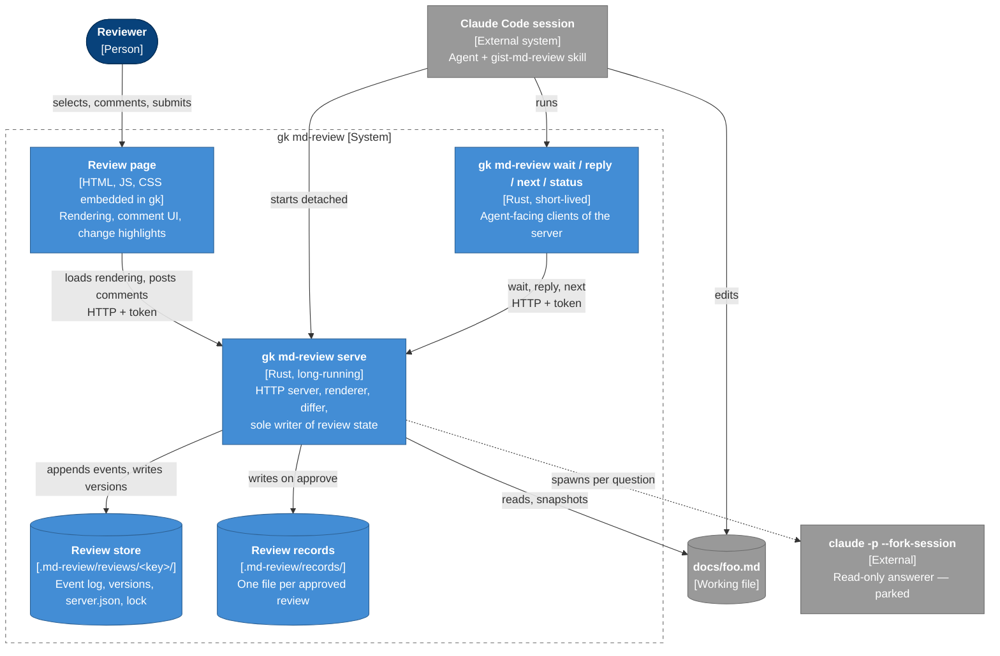
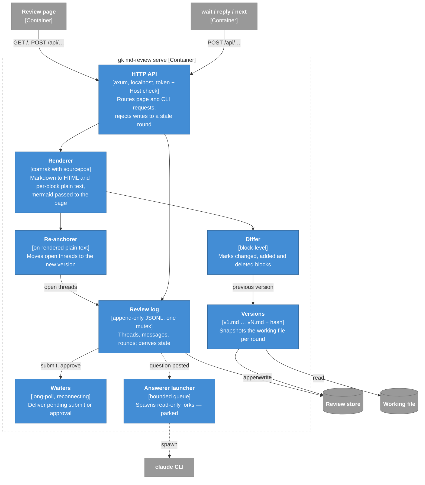
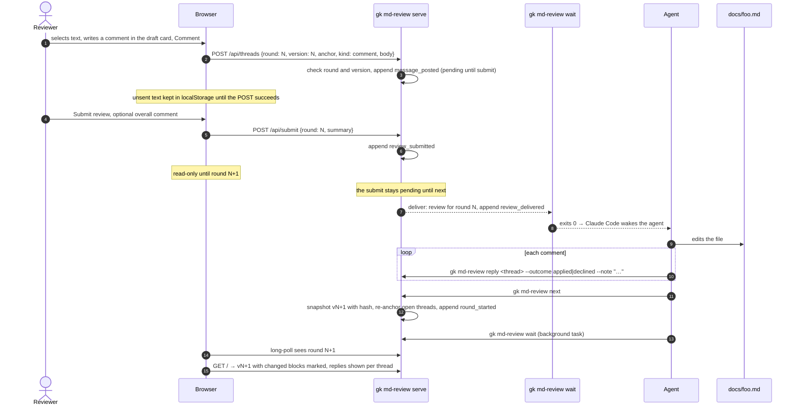
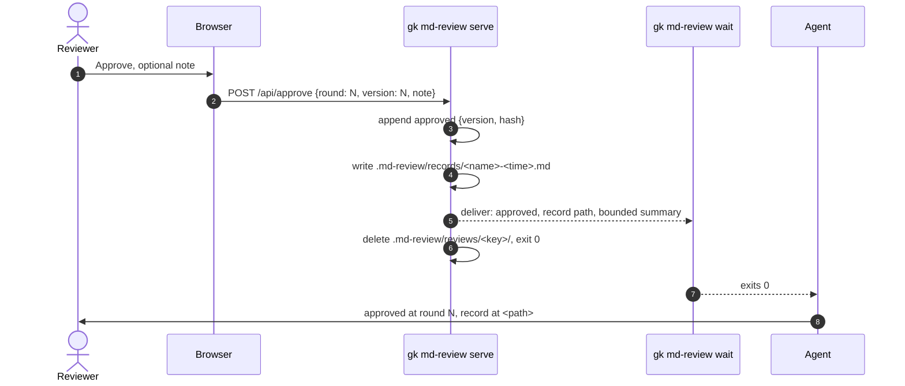

# Markdown review loop — high-level design (HLD)

Detail lives in DLDs next to this file: the review page in
[md-review-dld-page.md](md-review-dld-page.md).

Status: slice 1 built; first trial by hand on 2026-10-01, recorded in
`docs/cases/gist-md-review.md`. A CEO review (2026-09-26, scope reduction) is
applied; the steps in `TODO.md` replaced a full eng review. Decisions that
survive review move to ADRs; observable behavior moves to
`docs/cases/gist-md-review.md`.

## Problem

Reviewing a long markdown document with an agent in a terminal is slow. The
human has to quote the text they mean, the agent has to find it, and after an
edit nobody sees what changed. The human wants to read the rendered document,
mermaid included, comment on any selection, submit the whole review at once,
and see the next version with its changes highlighted.

## Scope

Slice 1, the first build:

- One markdown file per review, rendered in a local browser page.
- Comments on arbitrary mouse selections, as cards in a margin beside the
  text; the agent receives them only on submit.
- Rounds: every submit produces a new version; the page marks the blocks
  that changed since the previous one.
- A toolbar with Submit review (optional overall comment) and Approve,
  which needs no comments and is available at any time. Approve ends the
  review, keeps a review record, and drops the intermediate versions.
- Host: Claude Code only.

Slice 2, designed but deferred:

- **Vim key bindings** on the page, once a mockup shows `Selection.modify`
  behaves across browsers.
- **Word-level track changes** inside a changed block.
- **Export and import.** The page downloads the review (document, threads,
  unsent drafts) as a file; importing it resumes the review, through
  `serve`, so `serve` stays the only writer. Covers a dead machine or
  another browser; slice 1 covers a closed tab with the draft backup.
- **Answerer flags on `serve`.** `--model`, `--effort` and `--session`,
  recorded in `review_started`. Slice 1 `serve` takes the file only;
  Explain is their only reader.
- **Finer blocks.** Slice 1 blocks are the document's top-level elements:
  a whole list, table or block quote is one block for the gutter marks and
  the diff. Slice 2 may split lists and quotes into their items.
- **Block pairing by content.** Slice 1 pairs changed blocks in order, so a
  paragraph inserted before an edited one shows as changed and the edited
  one as added. Both are still marked.
- **Images with relative paths.** `serve` serves only the page and its own
  assets, so an image the markdown names by a repository path does not
  load. Serving them needs a confined path under the file's directory.
  An image cannot be commented on either: a selection over an image alone
  quotes nothing, and the server refuses it. Slice 2 lets a selection take
  an image whole, as it takes a diagram.
- **Link from an applied thread to its change.** Slice 1 cards say only
  "applied in round N". When the anchor's lines overlap a block changed
  in that round, the card links to it.

Parked, designed for but not built:

- **Explain.** A question on a selection, answered while the review goes on,
  without editing the file. Answered by a read-only fork of the agent session.
  Until it is built, `serve` refuses a question.
- **Codex** as a second host.
- **Live comments** delivered one by one instead of per submit.

Out of scope: reviewing code, multi-user review, anything reachable from
outside the machine.

## Principles

1. **The file on disk is the document.** The agent edits it with its normal
   tools. `gk` never rewrites the markdown; it only snapshots it.
2. **One writer.** Only the server process writes review state; it holds an
   exclusive lock on the store for its lifetime. Every other
   `gk md-review` command is a client of it.
3. **The agent is woken, not polled.** Claude Code wakes the agent when a
   background task exits. `gk md-review wait` exits on submit; no MCP, no
   "I'm done" typed in chat.
4. **Nothing is lost on a crash.** State is an append-only log on disk, not
   server memory. A restarted server resumes the review. A submit stays
   pending until the agent acts on it, so delivery is at least once, and a
   repeat is marked as one.
5. **Evidence outlives the review.** Approve deletes the working state but
   first writes a review record: every thread, outcome and the approved
   version.
6. **The skill owns the procedure.** `gk` output is data plus a one-line
   command reminder, never a prompt. Changing the workflow is a skill edit,
   not a Rust change.
7. **Explain never edits.** The answerer runs with read-only tools; that is
   enforced by the tool allowlist, not asked for in a prompt.

## Context (C4 level 1)

C4 notation drawn as mermaid flowcharts; mermaid's own C4 layout overlaps
labels. Dark blue is a person, blue is this system, grey is outside it,
dotted lines are parked.


## Containers (C4 level 2)



| Container | Lifetime | Writes |
|---|---|---|
| Review page | a browser tab | nothing; posts to the server |
| `serve` | from start of review until approval is delivered, or stop | the review store and the review record |
| `wait`, `reply`, `next`, `status` | one call | nothing; ask the server |
| Review store | from start of review until approval is delivered | — |
| Review record | until the user deletes it | — |
| Answerer (parked) | one question | nothing; its answer returns via the server |

## Components of `serve` (C4 level 3)



## Review page

Review mode as in Google Docs: the document on the left, comment cards in a
margin on the right, level with their text. Layout, card states and
re-anchoring are in the [page DLD](md-review-dld-page.md). A toolbar stays
at the top, as in GitLab's merge request review:

```
docs/foo.md · round 2 · 3 pending   [Show changes ✓]  [Submit review]  [Approve]
```

- **Selection.** Selecting text opens a draft card in the margin: a text
  field and a **Comment** button. **Explain** joins it when the parked flow
  is built. A pending comment can be edited or deleted until submit.
- **Submit review** opens a dialog: an optional overall comment and the list
  of pending comments. Submit is possible with inline comments, an overall
  comment, or both. With neither there is nothing to send; the dialog's
  Submit is disabled, the server refuses an empty submit, and Approve is
  the way out.
- **Approve** opens a small confirm with an optional note, and needs no
  comments. It is available at any time, also while the agent is revising;
  the confirm then warns that the approval covers the version on screen,
  not the agent's edits in progress. With pending comments the dialog lists
  them and offers "Discard and approve" or going back to submit them.
- **Between submit and the next round** the page is read-only. A banner
  says whether the agent has the submit yet, since when it revises, and
  how many comments it has answered; the next round appears by itself. A
  comment written now would anchor to a version that is about to change.
- **Show changes** marks the blocks changed since the previous version;
  deleted blocks show as struck stubs.
- **Connection indicator**, always visible: agent listening, agent
  revising, agent not listening yet, agent away (both with the request
  that resumes the review, to give the agent), or server offline. The page reconnects to `serve` by itself and keeps unsent drafts
  in browser storage until `serve` accepts them.
- **Banners** say when the working file differs from the version on
  screen, and when a write was refused because the page is stale (the page
  catches up by itself; drafts are kept).

## Flows

### Start a review

```mermaid
sequenceDiagram
  autonumber
  actor H as Reviewer
  participant A as Agent (Claude Code)
  participant S as gk md-review serve
  participant FS as Review store
  participant B as Browser

  H->>A: "review docs/foo.md with me"
  A->>S: gk md-review serve docs/foo.md --detach
  S->>FS: lock .md-review/reviews/<key>/, check log format
  S->>FS: snapshot v1, write server.json (with gk version)
  S-->>A: URL with token (stdout, first line); the caller returns
  A->>H: prints the URL
  A->>S: gk md-review wait (background task, blocks)
  H->>B: opens URL
  B->>S: GET / → rendered v1
```

`serve --detach` runs the server as a process of its own, in its own
process group, and returns once it has printed the URL. Claude Code stops
a background task after at most two hours, and the server must run for
the whole review, so it is not a host task; only `wait` is, and it ends
itself before the limit. The server outlives the agent session: a later
session continues the review, and `stop` or a delivered approval ends it.

`serve` on a file that already has a live server does not start a second one:
it cannot take the store lock, so it prints the existing URL and exits 0. A
stale `server.json` whose process is gone is replaced, and the review
resumes from the log, on the old port when it is free and with the old
token, so a tab left open reconnects. `stop` keeps `server.json` for this;
clients find no process behind it and say no server runs.

`serve` exits 1 and writes nothing when the store's log has a format this
`gk` does not know. A client whose `gk` version differs from the one in
`server.json` exits 1 and names `gk md-review stop`, so an upgrade never
talks to an old server.

### Comment and submit a round



The agent never sees half a review: comments are released only by submit.
A round may end with replies and no edits; `next` then records an unchanged
version so the round count stays honest.

- **Stale writes.** Every write from the page carries its round and version;
  the server checks them under the log mutex. A write to a submitted round
  or an old version gets 409, appends nothing, and the page keeps the draft,
  shows why and catches up by itself; a comment on an older version asks
  the reviewer to select the text again. A repeated submit of a closed round is idempotent.
- **Delivery.** A submit stays pending until `next`. `wait` started after
  the submit returns it at once, so a `wait` killed or never started loses
  nothing. `wait` long-polls in requests of about a minute and reconnects.
  A delivery after the first is marked with the first delivery time and
  the threads already replied to; the skill re-reads the file and skips
  them. Delivery is at least once, never silently dropped.
- **Presence.** The page shows the agent as away when no `wait` has polled
  for 90 s. The grace period covers the restart after a `wait` timeout, so
  the routine restart never shows. An agent that has the submit runs no
  `wait` until `next`, so it shows as revising, not away. `status` shows waiters and an
  undelivered submit.
- **File drift.** Each version is hashed. When the working file differs
  from the version the reviewer read by the time the review is delivered,
  someone other than the agent edited it; `wait` output and the page both
  say so, since the review's line numbers refer to the version read.

### Approve



Approve needs no comments: a document that is right on the first read is
approved at round 1. The working file already holds the final text.
Intermediate versions go with the store; git keeps whatever the user
committed along the way.

- **Any time.** Approve is allowed while a submit is pending. The agent's
  next `wait`, `reply` or `next` returns "approved" instead; a `reply` or
  `next` after approval exits 1 naming it.
- **Delivered like a submit.** The server keeps the store and keeps running
  until a client has received the approval, then deletes the store and
  exits. A `stop` before delivery keeps the store.
- **Bound to what was seen.** The approval names the version on screen and
  its hash. When the working file differs, because the agent edited after
  that version, the record says so and carries the full approved text
  and the block diff to the working file; the skill must not present that
  difference as approved. Deleting the store then loses nothing that was
  approved.
- **Review record.** A markdown file under `.md-review/records/`, outside
  the store and so kept after approval: every round's threads, messages
  and outcomes, the approve note, and the approved version. Complete, not
  bounded by `--limit`; `wait` prints its path and a bounded summary. The
  skill copies it into the merge request as review evidence. It names the
  approved version and its hash; it holds the approved text only when the
  working file differs, since otherwise the working file is that text.
- **Confined deletion.** A store that cannot be deleted safely is kept,
  and the approve answer to the page says so. `serve` then runs until
  `stop`: a client will not read `server.json` through a symlink, so
  `wait` cannot deliver that approval.

### Explain (parked)


On submit, question threads travel with the comments so the agent does not
edit against what the answerer told the reviewer. The answerer runs the
model and effort the review started with; the agent passes them at `serve`
time (`--model`, `--effort`), with the session id (`--session`). Verified on
Claude Code 2.1.283: a resumed fork honours `--model`, and `--effort` and
`--tools` exist. How the agent learns its own session id is open.

## Data

### Store layout

```
<repo root>/.md-review/reviews/<key>/  # key: hash of the file path
  lock                             # held by serve for its lifetime
  server.json                      # file, pid, port, token, gk version; mode 0600
  events.jsonl                     # append-only review log, records the path
  v1.md  v2.md  …                  # snapshot per round
<repo root>/.md-review/records/
  <name>-<time>.md                 # review record, written on approve
```

The store key is a hash of the file's path relative to the root: one path
segment, so deletion stays confined, and unique per path, so two files
never share a store. `review_started` records the path, and `status` shows
it. A record's `<name>` is the path flattened for reading (`docs-foo-md`);
it is never looked up, and the time keeps names apart. Approve deletes
only `reviews/<key>/`: the intermediate versions and working state. The
approved result stays, as the working file and the record.

The lock is an OS file lock (`File::lock`), released when `serve` dies, so a
crash never leaves a review locked.

`serve` adds `.md-review/` to `.git/info/exclude` rather than touching the
user's `.gitignore`. Outside a git repository the store goes next to the
working directory.

### Review log

One JSON object per line, each with `at`, the time it was appended in
seconds since the Unix epoch. Current state is a fold over the log.

| Event | Fields |
|---|---|
| `review_started` | format (1), file, version 1, hash; slice 2 adds host, model, effort, session (optional) |
| `message_posted` | thread, message, author (`human`/`agent`), kind (`comment`; `question` with Explain), body, anchor (new thread only), outcome (agent only: `applied`/`declined`; `answered` with Explain); Explain adds model (answerer only) |
| `message_edited` | message, body (reviewer's own pending message only) |
| `message_deleted` | message (reviewer's own pending message only) |
| `review_submitted` | round, summary (optional) |
| `review_delivered` | round, approved (`true` when the approval was delivered) |
| `round_started` | round, version, hash |
| `thread_resolved` | thread |
| `approved` | round, version, hash, note (optional), discarded (threads pending at approve) |

A log whose `format` this `gk` does not know, or whose `review_started`
names another file, is refused and left untouched.
Edits and deletes after submit get 409, like any stale write. Whether a
thread is orphaned is not an event: it is derived on fold, by re-anchoring
against the current version. Nor is reopening: a reviewer message after a
thread's resolution or its `applied` outcome reopens it on fold.

### Anchor

```json
{
  "quote": "selected text as rendered",
  "prefix": "≈40 chars before",
  "suffix": "≈40 chars after",
  "blocks": [12, 13],
  "lines": [41, 44],
  "headings": ["Loop", "Anchors"],
  "version": 3,
  "span": {"start": {"block": 12, "at": 4}, "end": {"block": 13, "at": 9}}
}
```

`lines` come from the renderer's source positions, so the agent can go
straight to the source. `quote` + `prefix`/`suffix` relocate the anchor after
small edits. `span` is where the quote is in `version`, in visible
characters per block; the page draws the thread from it without searching,
and the server records the new span when it moves the anchor. An anchor
logged before spans were recorded has none, and the page marks its whole
blocks. `headings` gives the answerer the section without reading the
whole file.

Re-anchoring runs on the server, against rendered text, not markdown
source: a quote over `**bold**`, a link or a code span would never match
the source. The renderer emits each block's plain text with its source
lines; the page sends the quote and the blocks it touches; the server
matches the quote in the next version's plain text with all whitespace
ignored, across block boundaries, so a quote may span blocks. A quote found without its context is re-attached only
when it occurs once under the same heading path in both the old and the
new version; anything else is orphaned rather than guessed. Steps in the
[page DLD](md-review-dld-page.md#re-anchoring-after-a-round).

### What `wait` returns

The agent reads the default human rendering; `--json` is for tests and
scripts. Both are required by `docs/tool-contract.md`. TOML was considered
and rejected: a third format, awkward for nested threads with multi-line
text, and a new dependency.

Human rendering, what wakes the agent:

```
review submitted · docs/foo.md · round 2 · 2 threads

summary
  Good structure. Cut the security section by half.

[t7] comment · lines 41–44 · Loop › Anchors
  > A comment stores the quoted text, surrounding context, and the source line range
  Too long; one sentence.

[t9] question · lines 88–90 · Security · answered by claude-fable-5-1
  > Check the Host header against 127.0.0.1:<port>
  Why is the token not enough?
  ↳ The token keeps other pages out; the Host check stops DNS rebinding.

next: gk md-review reply docs/foo.md <id> --outcome applied|declined --note "…", then gk md-review next docs/foo.md
```

The skill owns the procedure; the output carries data and a one-line
reminder of the commands, like git's hints. It helps after context
compaction and never grows into a prompt. Reviewer text is always quoted
under its thread id, so a comment reads as a comment, not as an
instruction to the agent.

JSON rendering:

```json
{"status": "ok", "data": {
  "event": "review_submitted",
  "file": "docs/foo.md",
  "round": 2,
  "version": 2,
  "summary": "Good structure. Cut the security section by half.",
  "threads": [
    {"id": "t7", "anchor": {…}, "messages": [
      {"author": "human", "kind": "comment", "body": "Too long; one sentence."}
    ]}
  ],
  "total": 1
}}
```

Or `{"event": "approved", "file": "docs/foo.md", "round": N, "version": N,
"note": "…", "record": "<path>", "file_differs": false, "threads": {…},
"discarded": […]}`: `threads` is the tally (total, applied, resolved,
open) and `discarded` the threads still pending at approve, never sent to
the agent. The record holds the rest. `summary`, `note` and `discarded`
are omitted when empty. Bounded: a submit with more
threads than `--limit` reports `truncated`, and the agent pages with
`gk md-review status --round N`.

`{"event": "timeout", "after": "110m"}` when `--timeout` expires with
nothing pending; the skill starts `wait` again.

`{"event": "stopped", "file": "docs/foo.md"}`, exit 0, when no server runs
for the file or it stops during the wait; the skill starts no further
wait. A stopped server is an outcome, like a timeout, so the agent never
tells outcomes apart by an error's wording.

Two additions, both omitted when they do not apply:

- `redelivered`: the first delivery time and the threads already replied
  to. Human rendering: a line under the header,
  `redelivered · first 14:02 · replied t7`.
- `file_differs`: the working file is not the version the reviewer read.
  Human rendering: `warning: docs/foo.md changed since round 2 was
  read; line numbers refer to v2`.

## HTTP API

Every request needs the Host `127.0.0.1:<port>` (else 403) and the token,
as `Authorization: Bearer` or the `token` query parameter (else 401).
`GET /assets/*` alone needs no token: a browser loads module imports
without the page's query string, and the assets hold nothing secret.
A refusal answers `{"message": "…"}` and appends nothing.

| Route | Caller | Does |
|---|---|---|
| `GET /` | browser | the page, with a CSP that allows only `serve`, and `Referrer-Policy: no-referrer` since the URL holds the token |
| `GET /assets/{name}` | browser | the page's scripts, styles, icon and the embedded `mermaid.min.js` |
| `GET /api/review?after&hold&have` | page | everything the page draws: blocks and changes since the previous version, left out when the page already holds that version (`have`), threads anchored to the current version, phase, agent presence, drift; at once when its `seq` differs from `after`, else after `hold` (at most 60 s) |
| `POST /api/threads` | page | a comment: a new thread with an `anchor`, or a reply with a `thread`; the page picks the message id, so a retry appends nothing |
| `PATCH`, `DELETE /api/messages/{id}` | page | edit or delete a pending comment |
| `POST /api/threads/{id}/resolve` | page | resolve a thread |
| `POST /api/submit` | page | submit the round, with an optional summary |
| `POST /api/approve` | page | approve the version on screen; writes the record and returns its path, and `store_kept` when the store could not be deleted |
| `GET /api/wait?hold&limit` | `wait` | a pending approval or submit, else the first within `hold`, else 204 |
| `POST /api/reply` | `reply` | the agent's outcome and note on a thread |
| `POST /api/next` | `next` | snapshot the working file as the next version and start the next round |
| `GET /api/status?round&limit&offset` | `status`, clients finding a live server | where the review stands |
| `POST /api/stop` | `stop` | end the server, keep the store |

Page writes carry `round` and `version`; one against another round or
version, or after submit or approval, gets 409. `reply` and `next` get 409
unless a submitted round waits for them, and after approval.

## CLI surface

| Command | Does | Exit |
|---|---|---|
| `gk md-review serve <file> [--detach]` | starts or reuses the server, prints the URL; with `--detach` the server runs on its own and the command returns | runs until approval is delivered, or stop; with `--detach`, 0 once the URL is printed, else the server's exit code and message; 0 when reusing a live server; 1 on bind failure, unknown log format, file over 1 MiB or not UTF-8 |
| `gk md-review wait <file> --timeout <dur> [--limit N]` | returns a pending submit or approval, or blocks until one or the timeout; reports a server that is not running or stops | 0 on event, timeout or stopped server; 1 on version mismatch |
| `gk md-review reply <file> <thread> --outcome … --note …` | records the agent's answer to a thread | 0 / 1; 1 unless a submitted round waits, and after approval, naming it |
| `gk md-review next <file>` | closes the round, snapshots the next version | 0 / 1; 1 unless a submitted round waits, after approval naming it, and on a file over 1 MiB or not UTF-8 |
| `gk md-review status <file> [--round N] [--limit N] [--offset N]` | current round, open threads, waiters, undelivered submit; with `--round`, that round's submitted threads, paged by `--limit` and `--offset` | 0 / 1 |
| `gk md-review stop <file>` | stops the server, keeps the store | 0 / 1 |

`--limit` caps the threads listed and defaults to 25. All take `--json`
and follow the envelope in `docs/tool-contract.md`.
Every client takes the reviewed file, so a review started from another
session never reaches this session's `wait`.
`serve` and `wait` block; the contract's "Long-running subcommands"
section covers them.

## Security

- Bind to 127.0.0.1 only; random port; random token in the URL and in
  `server.json` (0600). Every request carries the token, except reading
  the page's own assets under `/assets/`; the Host check covers those too.
- Check the `Host` header against `127.0.0.1:<port>` to refuse DNS rebinding.
- Any local process that reads the token could post comments the agent acts
  on, or start answerer runs that cost model calls. Accepted for a
  single-user machine; the token keeps other browser tabs out.
- Rendered markdown is untrusted: no raw HTML passthrough, `javascript:`
  links stripped, mermaid in strict security mode, no external requests
  from the page. The CSP allows scripts, images and requests from `serve`
  only. It allows inline styles, which mermaid writes into its diagrams; a
  style cannot send anything out under that policy.
- The bundled `mermaid.min.js` is pinned to a version, with its checksum
  recorded in the repository, and compiled into `gk`
  ([ADR 0015](../adr/0015-md-review-http-stack.md)).
- `serve` refuses a file over 1 MiB with exit 1, naming the limit, so
  rendering, diffing and `wait` output stay bounded.
- Store deletion reuses the confined-path and symlink refusal of ADRs 0008
  and 0010; a store that cannot be deleted safely is kept.

## Settled

- **`wait` times out before the host does.** Claude Code stops a
  background task at its timeout (at most 2 h), reports it as killed and
  tells the agent not to restart it. So `wait` takes `--timeout` below that
  limit (110 min under 120), exits 0 with a `timeout` event, and the skill
  starts it again: one short agent turn per idle timeout. A review takes as
  long as the reviewer needs; a submit during the restart is pending, not
  lost. Verified on 2026-10-01 with a spike: a click woke the agent; a task
  that hit the limit was killed with the no-restart note; one that timed
  out first completed cleanly; a submit after 31 min woke the agent.
- **Naming.** `gist-md-review`, next to `gist-doc-review`, which reviews
  code comments. The skill's description tells them apart: the user
  reviews a markdown file themselves, not the agent reviewing code.
- **Answerer model.** Same model and effort as the review started with.
  `claude -p --resume <sid> --fork-session --model <m>` honours the model
  (verified on 2.1.283).

## File arrangement

```
docs/
  design/
    md-review-hld.md               # this HLD; ongoing work, linked from TODO.md
    md-review-dld-page.md          # DLD: review page, cards, keys, re-anchoring
  cases/
    gist-md-review.md              # behavior cases, written before implementation
  adr/
    0013-wake-the-agent-with-a-background-wait.md  # background wait over MCP
    0014-review-state-in-an-append-only-log.md     # event log, one writer, store
    0015-md-review-http-stack.md   # axum, mermaid embedded, long-poll
  tool-contract.md                 # new section: long-running subcommands
  architecture.md                  # one row for md_review/
skills/
  gist-md-review/
    SKILL.md                       # drives the loop: serve, wait, edit, reply, next
    references/
      review-json.md               # the wait payload, for the agent
tools/crates/gist-cli/src/md_review/
  mod.rs                           # subcommands, argument parsing
  serve.rs                         # HTTP API, token and Host checks
  api.rs                           # what serve answers the clients, Human and Serialize
  client.rs                        # wait/reply/next/status talking to serve
  store.rs                         # event log, fold, lock, versions, server.json
  record.rs                        # review record written on approve
  render.rs                        # comrak with sourcepos, block plain text, heading paths
  diff.rs                          # block diff between versions
  anchor.rs                        # re-anchoring on rendered text
  assets/                          # page.html, page.js, page.css, mermaid.min.js
    anchor.js  margin.js           # pure functions, unit tested with node --test
tools/crates/gist-cli/tests/md_review.rs
```

`answer.rs`, the answerer launcher, belongs to the parked Explain flow and is
not created in slice 1. `node --test` runs in `just ci` with no npm
dependencies; the DOM glue is covered by the host case.

`docs/design/` is new: a place for designs of work in progress, too long for
`TODO.md` and not yet decisions. When the feature ships, lasting parts move
to `architecture.md`, cases and ADRs, and the design file is deleted or
reduced to what the others do not cover.

## Open questions

1. **Session id** for the Explain fork: how the agent or `gk` learns it.
   A hook sees it; the agent may not.
